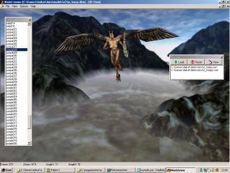

# DaikatanaTools
Source code for the old daikatana tools DaiMdl DaiPak and DaiWal. Over the years occasionaly people have shown a continued interest in these tools and the file formats.

This release is based on code from an old backup so it may not exactly match the last released binaries that can be found around the internet. The original code was written in Delphi 3 but this release is modifed slightly to compile using the open source Lazarus project. Note that the lazarus form layout is slightly different from Delphi and there were some isues with modal dialogs but generally things seem to be working fine (verified using data from the daikatana demo paks).

*Warning:* The source code is likely not a good basis to continue developing on. I was a self taught teenager with no computer science education when I wrote these so the code quality is questionable. 

